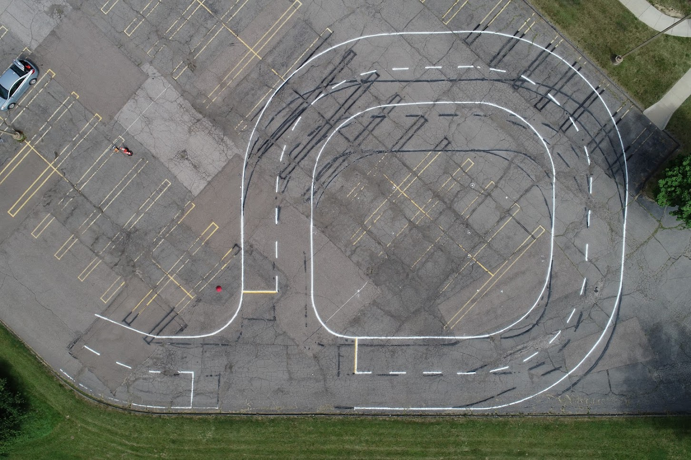

# Line Follow
Line following algorithm for the Polaris GEM e2 ACTor vehicle.

# Test Course
Parking Lot H


# Dependencies
Make sure you have the following packages in your workspace:
- DataspeedInc's [dwb_polaris_can](https://bitbucket.org/DataspeedInc/dbw_polaris_ros)
- Allied Vision's [avt_vimba_camera](https://github.com/astuff/avt_vimba_camera)

# Usage
On the ACTor vehicle:

Clone this repo to `~/actor_ws/src` and build the package using `catkin build`.
```sh
$ git clone https://github.com/irisfield/team_triangle.git
```

Make sure to give execution permission to the scripts:
```sh
$ chmod +x team_triangle/scripts/*.py
```

Assuming you have already sourced the setup script, run the package:
```sh
$ roslaunch team_triangle actor_follow_line.launch
```

# Notes
- The drive-by-wire CAN bus needs to be connected.
